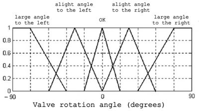

# Automatic Water Temperature Regulation

This project implements a system for automatic water temperature regulation using fuzzy logic. Utilizing linguistic variables, rules, and sets, the system aims to optimally control the rotation angle of the tap based on water temperature and tilt angle.

## Theoretical Part

### Input Linguistic Variables

- β1: Water temperature
- β2: Tilt angle

### Rule

1. If the water is hot, turn the faucet valve to a large angle to the right.
2. If the water is not very hot, turn the faucet valve to a small angle to the right.
3. If the water is warm, leave the angle of rotation of the tap unchanged.
4. If the water is cool, turn the faucet valve to a small angle to the left.
5. If the water is cold, turn the faucet valve to a large angle to the left.

### Sets

- T1: {hot, not very hot, warm, not very cold}
- T2: {large angle right, small angle right, zero, small angle left, large angle left}

## Mamdani Algorithm

Applying the Mamdani algorithm for water temperature of 55 degrees Celsius results in a truth value of 0.5 for rules 2 and 3, which are used in the current fuzzy inference process.

Aggregating membership functions keeps the truth value at 0.5.

## Defuzzification

To determine the angle of rotation of the tap, the center of gravity method is employed, considering the values of the membership function.
$$
y = \frac{\int x \mu(x) \,dx}{\int \mu(x) \,dx}
$$

## Implementation

Development and debugging are done using Python tools, specifically skfuzzy, numpy, and matplotlib. The computation results are communicated to the frontend using the Flask framework.

The frontend part of the project is available on GitHub: [hydro-tap](https://github.com/Euphoriaerika/hydro-tap).

## Contact

For any questions or suggestions regarding this project, feel free to contact me via [LinkedIn](https://www.linkedin.com/in/bohdan-rudenko-b5726928a/).